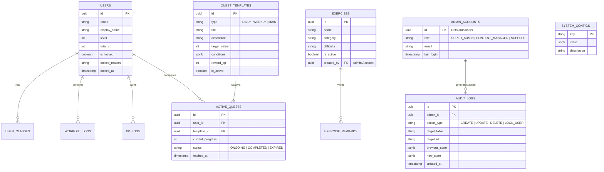

# Entity Relationship Diagram (ERD) - GymLevel Admin & Gamification

Sơ đồ dưới đây tập trung vào Mối Quan Hệ Dữ Liệu (Data Relationship) cốt lõi dành cho Admin Panel và các khối Gamification. Các bảng hệ thống Workout hiện tại (Profile, Workout, Exercise) sẽ được mở rộng bằng cách thêm Relations với Admin.

## Giải thích mở rộng (Schema Changes)

1. **`users` Table:**
   - Cần bổ sung thêm thông tin về cấm túc: `is_locked` (Boolean), `locked_reason` (Text), `locked_at` (Timestamp). Để Admin sử dụng cờ này khóa mõm hoặc ban tài khoản.
2. **`admin_accounts` & `audit_logs`:**
   - Bảo mật cốt lõi: Mọi thao tác ghi/xóa từ admin đều phải được viết qua RPC có lưu dấu vết vào Audit Logs (Theo dõi lịch sử chỉnh sửa tập lệnh).
3. **`system_configs`:**
   - Rất quan trọng để lưu tham số động (Dynamic Parameters) như Xp Requirement Modifier, Max Workout Per Day. Admin chỉ sửa Field này, client tự cập nhật mà không phải update app.
4. **`quest_templates`:**
   - Dùng để Admin tạo Content hàng ngày một cách linh động.
